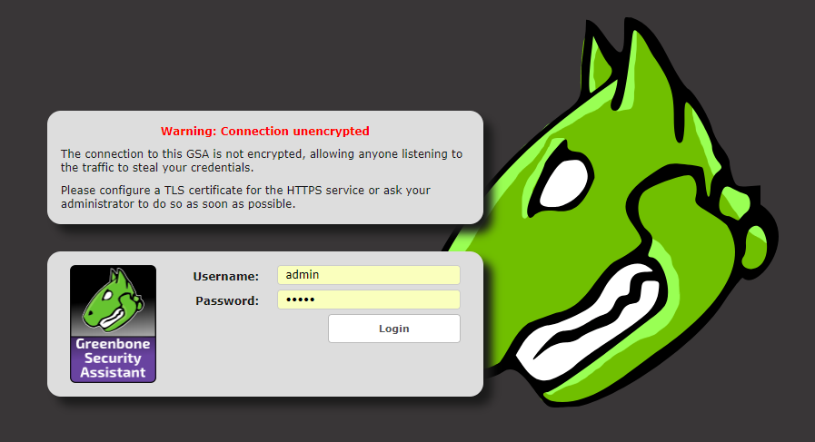

# OpenVAS
Nessusからフォークしたサーバセキュリティ診断ツール  
ホスト型で診断サーバを用意し対象のサーバに対してNW経由、SSH経由で診断を行う  

## インストール
OpenVASサーバを構築する  
リポジトリの追加  

```
# yum install wget bzip2 texlive net-tools alien gnutls-utils
# wget -q -O - https://www.atomicorp.com/installers/atomic | sh
```

※AmazonLinuxの場合、AmazonLinux用のリポジトリが追加されるがリポジトリにパッケージは用意されていないため  
  CentOS用等に書きかえる必要がある（2018年時点）  
※AmazonLinuxの場合`libssh`ライブラリの依存関係で起動しない事がある  
  その場合はCentOS版な`libssh < 0.7`になるようパッケージを追加インストールする必要がある  

インストール  

```
# yum install openvas atomic-sqlite-sqlite-devel --enablerepo=epel
```

必要なユーザーが作成されている  

```
# getent passwd
~
polkitd:x:997:994:User for polkitd:/:/sbin/nologin
unbound:x:996:993:Unbound DNS resolver:/etc/unbound:/sbin/nologin
tss:x:59:59:Account used by the trousers package to sandbox the tcsd daemon:/dev/null:/sbin/nologin
redis:x:995:992:Redis Database Server:/var/lib/redis:/sbin/nologin
```

redisの起動  

```
# vim /etc/redis.conf
unixsocket /tmp/redis.sock
unixsocketperm 700

# systemctl enable redis
# systemctl start redis 
```

セキュリティ定義のダウンロード  

```
# openvas-setup


Openvas Setup, Version: 3.0


Step 1: Update NVT, CERT, and SCAP data
Please note this step could take some time.
Once completed, this will be updated automatically every 24 hours

Select download method
* wget (NVT download only)
* curl (NVT download only)
* rsync

  Note: If rsync requires a proxy, you should define that before this step.
Downloader [Default: rsync]

Step 2: Configure GSAD
The Greenbone Security Assistant is a Web Based front end
for managing scans. By default it is configured to only allow
connections from localhost.

Allow connections from any IP? [Default: yes]
Redirecting to /bin/systemctl restart gsad.service
Job for gsad.service failed because the control process exited with error code. See "systemctl status gsad.service" and "journalctl -xe" for details.

Step 3: Choose the GSAD admin users password.
The admin user is used to configure accounts,
Update NVT's manually, and manage roles.

Enter administrator username [Default: admin] :
Enter Administrator Password:
Verify Administrator Password:

/usr/sbin/openvasmd: symbol lookup error: /lib64/libopenvas_misc.so.9: undefined symbol: ssh_pki_key_ecdsa_name
/usr/sbin/openvasmd: symbol lookup error: /lib64/libopenvas_misc.so.9: undefined symbol: ssh_pki_key_ecdsa_name

Setup complete, you can now access GSAD at:
  https://<IP>:9392

Created symlink from /etc/systemd/system/multi-user.target.wants/openvas-scanner.service to /usr/lib/systemd/system/openvas-scanner.service.
Created symlink from /etc/systemd/system/multi-user.target.wants/openvas-manager.service to /usr/lib/systemd/system/openvas-manager.service.
Created symlink from /etc/systemd/system/multi-user.target.wants/gsad.service to /usr/lib/systemd/system/gsad.service.
```

ダウンロード方法を`wget`,`curl`,`rsync`から選べと言われる、デフォルトは`rsync`  
OpenVASマネージャへのアクセスユーザーとパスワードも聞かれる  

インストール後起動しようとするが失敗する  
構成確認スクリプト内のコマンドパスが間違っているので修正する  

```
# vim /bin/openvas-check-setup
```

再実行  

```
# openvas-check-setup --v9

openvas-check-setup 2.3.7
  Test completeness and readiness of OpenVAS-9

  Please report us any non-detected problems and
  help us to improve this check routine:
  http://lists.wald.intevation.org/mailman/listinfo/openvas-discuss

  Send us the log-file (/tmp/openvas-check-setup.log) to help analyze the problem.

  Use the parameter --server to skip checks for client tools
  like GSD and OpenVAS-CLI.

Step 1: Checking OpenVAS Scanner ...
        OK: OpenVAS Scanner is present in version 5.1.1.
        OK: redis-server is present in version v=3.0.7.
        OK: scanner (kb_location setting) is configured properly using the redis-server socket: /tmp/redis.sock
        OK: redis-server is running and listening on socket: /tmp/redis.sock.
        OK: redis-server configuration is OK and redis-server is running.
        OK: NVT collection in /var/lib/openvas/plugins contains 44912 NVTs.
        WARNING: Signature checking of NVTs is not enabled in OpenVAS Scanner.
        SUGGEST: Enable signature checking (see http://www.openvas.org/trusted-nvts.html).
        OK: The NVT cache in /var/cache/openvas contains 44912 files for 44912 NVTs.
Step 2: Checking OpenVAS Manager ...
        OK: OpenVAS Manager is present in version 7.0.2.
        OK: OpenVAS Manager database found in /var/lib/openvas/mgr/tasks.db.
        OK: Access rights for the OpenVAS Manager database are correct.
        OK: sqlite3 found, extended checks of the OpenVAS Manager installation enabled.
        OK: OpenVAS Manager database is at revision 184.
        OK: OpenVAS Manager expects database at revision 184.
        OK: Database schema is up to date.
        OK: OpenVAS Manager database contains information about 44908 NVTs.
        OK: At least one user exists.
        OK: OpenVAS SCAP database found in /var/lib/openvas/scap-data/scap.db.
        OK: OpenVAS CERT database found in /var/lib/openvas/cert-data/cert.db.
        OK: xsltproc found.
Step 3: Checking user configuration ...
        WARNING: Your password policy is empty.
        SUGGEST: Edit the /etc/openvas/pwpolicy.conf file to set a password policy.
Step 4: Checking Greenbone Security Assistant (GSA) ...
        OK: Greenbone Security Assistant is present in version 7.0.2.
        OK: Your OpenVAS certificate infrastructure passed validation.
Step 5: Checking OpenVAS CLI ...
        OK: OpenVAS CLI version 1.4.5.
Step 6: Checking Greenbone Security Desktop (GSD) ...
        SKIP: Skipping check for Greenbone Security Desktop.
Step 7: Checking if OpenVAS services are up and running ...
        OK: netstat found, extended checks of the OpenVAS services enabled.
        OK: OpenVAS Scanner is running and listening on a Unix domain socket.
        OK: OpenVAS Manager is running and listening on a Unix domain socket.
        OK: Greenbone Security Assistant is listening on port 80, which is the default port.
Step 8: Checking nmap installation ...
        WARNING: Your version of nmap is not fully supported: 6.47
        SUGGEST: You should install nmap 5.51 if you plan to use the nmap NSE NVTs.
Step 10: Checking presence of optional tools ...
        OK: pdflatex found.
        WARNING: PDF generation failed, most likely due to missing LaTeX packages. The PDF report format will not work.
        SUGGEST: Install required LaTeX packages.
        OK: ssh-keygen found, LSC credential generation for GNU/Linux targets is likely to work.
        OK: rpm found, LSC credential package generation for RPM based targets is likely to work.
        OK: alien found, LSC credential package generation for DEB based targets is likely to work.
        OK: nsis found, LSC credential package generation for Microsoft Windows targets is likely to work.
        OK: SELinux is disabled.

It seems like your OpenVAS-9 installation is OK.

If you think it is not OK, please report your observation
and help us to improve this check routine:
http://lists.wald.intevation.org/mailman/listinfo/openvas-discuss
Please attach the log-file (/tmp/openvas-check-setup.log) to help us analyze the problem.
```

再起動  

```
# systemctl start openvas-scanner
# systemctl start openvas-manager
# systemctl start gsad
```

成功するとGUIが起動し設定したアカウント情報でログインできる  
http://<IP address>  

  
