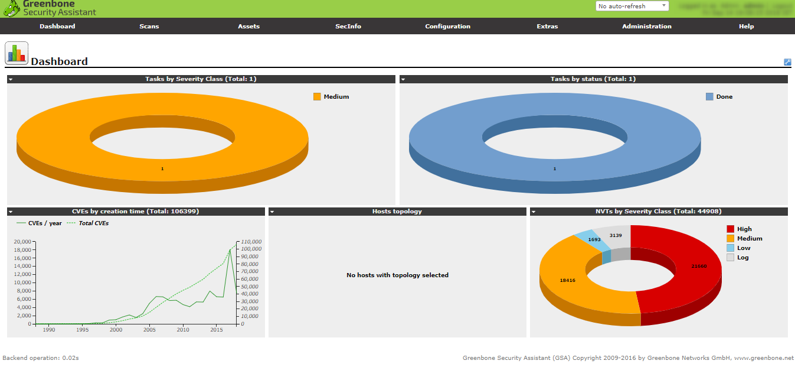
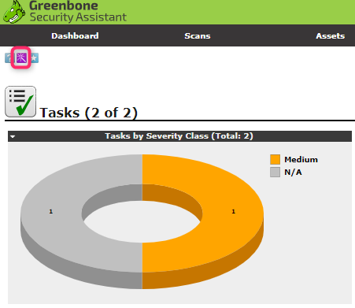

# OpenVAS
ログインするとダッシュボードが表示される  
  

## スキャンの実施
OpnVASサーバ --> 対象サーバに対してスキャンを実施する  

### Immediate Scan  
メニューバー「Scans」から「Tasks」を選択  
  

左上のマークから「Task Wizard」で追加する  
  

  

スキャンが完了するとタスクステータス、レポート状況が追加される  
  

### Advanced Scan
メニューバー「Configration」から「Credentials」を選択  
  

SSHの接続情報を設定する  
  

「Scans」->「Tasks」の左上のマークから「Task Wizard」->「Advanced Task Wizard」  
  

先程作成したSSH接続情報を選択しタスクを作成しスキャン実施  
  

Advanced Scanは30～40分かかる場合もある  

## テスト内容
「Configuration」->「Scan Configs」から確認できる  
例えばQuickScanで利用される「Full and fast」では下記のようになっている  
  

* Network Vulnerability Test Families
* Scanner Preferences
* Network Vulnerability Test Preferences

スキャナーの設定を除くと内容はネットワークスキャンに関するポリシーが定義されている  
SSH設定はあるが、OS内部の状況についてはスキャンしない  

## スキャンレポートの確認  
「Scans」->「Reports」から確認できる  
  

適当に立てたサーバに対してスキャンを実行した場合（FWあり）SSHに対する脆弱性が検知された   
SSHで利用されている暗号化強度が弱いものらしい  
